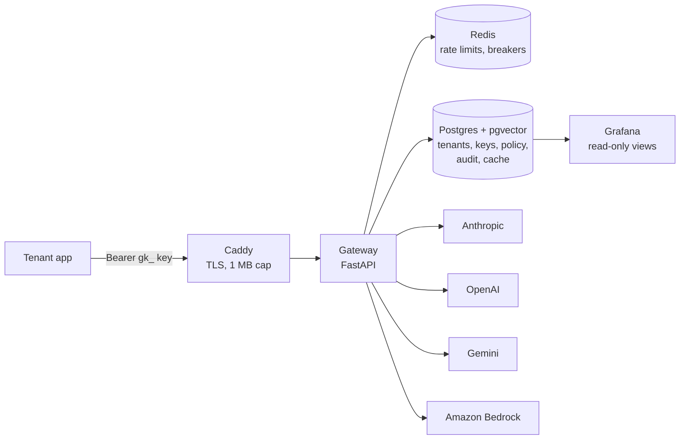

# gate.atla.in: an enterprise LLM gateway

One API in front of **Anthropic, OpenAI, Google Gemini and Amazon Bedrock**, with the controls a platform team needs before letting applications near a model: per-tenant keys, rate limits, monthly budgets, failover, policy (PII, allow-lists, enforced instructions), agent governance, a semantic cache, versioned prompts with staged rollout, feature flags, nightly quality evaluations and a complete audit trail.

It runs in production at **https://gate.atla.in** on AWS, deployed with Terraform, and serves three real tenants:

| Tenant | What it is | How it uses the gateway |
|---|---|---|
| [gita.atla.in](https://gita.atla.in) | RAG app on Amazon EKS answering life questions with Bhagavad Gita verses | 3 model calls per question on Bedrock (Nova 2 Lite), strict JSON, 25-case evaluation in CI |
| [atla.in](https://atla.in) chatbot | Public portfolio assistant | Browser → Lambda → gateway; grounded in approved facts, PII blocked, $1/month hard stop, cached |
| [gate.atla.in](https://gate.atla.in) page chatbot | Public explainer for the gateway page itself | Browser -> same-origin proxy -> gateway as `gate-chatbot`; Sonnet-only, no browser key, PII blocked, $3/month hard stop, live safe telemetry |

---

## Why a gateway

Without one, every application holds its own provider keys, picks its own models, has no spending ceiling, and leaves no central record of what was sent where. The gateway moves all of that to one place:

| Problem | What the gateway does |
|---|---|
| Provider keys scattered across apps | Apps hold a **virtual key** (`gk_…`); provider keys live only in the gateway (AWS SSM) |
| Four different APIs | One request and response shape for all providers |
| Prompt changes shipped blind | A **prompt registry**: immutable versions, staged rollout to a few users, one-command rollback, and **nightly evals** that flag a regression before visitors see it |
| Runaway spend | Per-tenant **RPM/TPM limits** and **monthly budgets**, with automatic downgrade or a hard stop |
| Provider outages | **Fallback chains** with **circuit breakers** |
| Personal data leaving the organisation | **PII redaction or blocking** before any provider sees the request |
| A public bot used as a free general LLM | **Model allow-lists**, size caps and gateway-enforced instructions |
| Agents calling tools unchecked | **Agent identities**, tool allow-lists, human approval, step and cost limits per run |
| No record of what happened | An **append-only audit log** of every call that passes the key and contract checks: model, tokens, cost, latency, rules fired. Never message content |

---

## Architecture



**Every request passes the same pipeline:**

```
key → contract → rate limit → policy → prompt + flags → cache → budget → circuit breaker → provider (with fallback) → audit
```

Measured overhead of the whole pipeline in production: **p50 4 ms** over the 7 days to 30 September 2026, from `GET /v1/stats` (the rest of each request is the provider generating).

---

## Features

| Area | Details |
|---|---|
| **Unified API** | `POST /v1/chat` with `model: "provider/model-id"`. Adapters translate to each provider's format and back, including tool calls (Anthropic, OpenAI) |
| **Identity** | Tenants and agents with hashed virtual keys (SHA-256; keys are never stored). Revoking one tenant never affects another |
| **Rate limiting** | Requests and tokens per minute, as a token bucket in an atomic Redis Lua script. Fails open if Redis is down |
| **Budgets** | Monthly budget per tenant. At a soft limit the tenant can be downgraded to a cheaper model; at 100%, `402` |
| **Failover** | Per-model fallback chains in priority order. Breakers open after repeated failures and probe before closing. Failover never escapes a tenant's allow-list |
| **Policy** | Per-tenant JSON: model allow-list, size cap, blocked phrases, PII mode (`redact`/`block`; email, card with Luhn check, Aadhaar, phone, PAN), token cap, enforced system instructions |
| **Prompt registry** | Tenants send `prompt: "name"`. The gateway resolves the rollout for (tenant, name) to a stable or candidate version. The pick is sticky per `user_key` (bucket 0-99), so a user keeps one variant while a rollout runs. Rollout changes are seen within 15 s |
| **Feature flags** | Named on/off switches with an optional percentage, global or per tenant (tenant wins). Never breaks a request: on a database problem it uses the last known values, then "off". Today's use: `cache_bypass` |
| **OKF bundles** | Tenants upload a knowledge bundle (`POST /v1/okf/{bundle_id}`, 1 MB cap) and attach concepts to a request with `okf_bundle` and `okf_concepts` |
| **Nightly evals** | See [Evals](#evals) below |
| **Semantic cache** | pgvector cosine similarity, scoped by tenant, model and full system text (editing instructions invalidates old answers). Threshold 0.95 after a real false hit at 0.92 |
| **Agents** | `ga_` keys, required run IDs, tool allow-lists, hallucinated tools dropped, human approval flags, per-run step and cost limits (fail closed) |
| **Audit** | Append-only `usage_events` table (a trigger blocks updates and deletes). Every call that passes the key and contract checks, including blocks and failures, with a request ID returned to the caller. A bad key (401) or an invalid body (422) is refused before the pipeline and is not recorded |
| **Observability** | Grafana dashboard provisioned from Git: calls, spend, error rate, governance blocks, latency split into provider time and gateway overhead, budgets, model mix, agent runs. Public aggregate totals at `GET /v1/stats` feed the [obs.atla.in](https://obs.atla.in) status page; `GET /v1/stats/evals` (counts, scores and verdicts only) feeds the live dashboard on the home page |
| **Tracing** | Optional LangSmith traces, metadata only (inputs and outputs are stripped). Enabled by `LANGSMITH_TRACING` |

---

## Evals

A fixed set of questions runs through the gateway every night, so a prompt or model change that makes answers worse is caught by a schedule, not by a visitor.

| Step | What happens |
|---|---|
| Cases | Hand-written (`python -m app.evalimport`, JSONL in `evals/`) or generated from an OKF bundle (`python -m app.evalgen`). Cases are immutable |
| Run | `python -m app.evalrun <tenant>/<set> <route> [prompt@version]` sends every question through the gateway as the `evals` tenant (cache bypassed, own budget) |
| Score | Rule checks (`contains`, `not_contains`, `max_words`...) plus an LLM judge against a reference answer. Score 0 to 1, pass at 0.7 |
| Compare | `python -m app.evalcheck` compares with a baseline of recent good runs. **REGRESSION** if the score drops by more than the larger of 0.10 and twice the baseline's own spread; **NOISY_BASELINE** if the baseline can't be trusted. A regressed run never joins a baseline. Exit code 3 or 4 |
| Schedule | A systemd timer on the host at 03:30 IST runs both chatbot sets (`facts-core`, `facts-guard-v2`) against the live prompt |
| Alert | Grafana alerts on **Eval regression** and **Eval job silent** |

---

## Results from production

| Test | Result |
|---|---|
| Acceptance suite (health, three providers, PII, allow-list, topic enforcement, burst, agent approval, oversized request) | 8/8 passed on the live deployment |
| gita migrated onto the gateway | **25/25** on its RAG evaluation, the same as before migration |
| Chatbot abuse tests (oversized input, PII, fake system role, model swap, invalid JSON, wrong method, other-origin browsers, bursts) | All refused by the intended layer |
| Semantic cache, repeated question | 3.5 s and $0.00052 → **0.4 s and $0.00000014** |
| Backup restore into a scratch database | Row counts identical to production |
| Gateway overhead | p50 4 ms (7 days to 30 September 2026) |

---

## Deployment (AWS, `ap-south-1`)

| Component | Choice |
|---|---|
| Compute | One `t4g.small` (Graviton) running Docker Compose: gateway, Postgres + pgvector, Redis, Grafana, Caddy |
| Network | Own VPC; inbound 443/80 only; **no SSH** (admin through SSM Session Manager); instance metadata blocked from containers |
| TLS | Caddy with automatic Let's Encrypt, HSTS, request size cap |
| Secrets | SSM Parameter Store SecureStrings, rendered onto the host at start; each container receives only the ones it needs |
| Images | ECR with immutable tags and scan-on-push |
| IAM | Least-privilege instance role (its own SSM path, its own ECR repo, backups read and write but never delete) |
| Backups | Nightly `pg_dump` to S3 (the host cannot delete backups), 30-day lifecycle, tested restores |
| Infrastructure as code | Terraform with remote state in S3 and native locking |
| Evals | `gate-eval.timer` runs the nightly eval and regression check; `gate-backup.timer` runs the backups |
| Releases | Every push to `main` deploys through GitHub Actions: arm64 image build, ECR push, release tag committed to `compose.yaml`, gateway restart over SSM, health check. AWS access by OIDC, no stored keys |
| Cost | About **$15/month**, under a $20 budget alarm |

---

## Repository layout

```
app/                  Gateway (FastAPI)
  providers/          Anthropic, OpenAI, Gemini and Bedrock adapters, shared HTTP client
  main.py             The request pipeline
  policy.py           PII, allow-lists, caps, enforced instructions
  budget.py           Spend tracking, downgrade, cost
  failover.py         Fallback chains, allow-list enforcement
  breaker.py          Circuit breakers
  ratelimit.py        Token buckets (with token_bucket.lua)
  cache.py            Semantic cache
  agents.py           Agent governance
  admin.py            Admin CLI: tenants, keys, agents
  prompts.py          Prompt registry, sticky staged rollout
  flags.py            Feature flags
  okf.py              OKF bundle upload and context
  evalrun.py          Run an eval set (also evalimport, evalgen, scorers)
  evalcheck.py        Baseline comparison and regression verdict
  stats.py            Public GET /v1/stats (stats_quality.py: /v1/stats/evals)
  tracing.py          Metadata-only LangSmith tracing
  static/landing.html Home page (served to browsers; JSON to API clients)
db/                   Numbered migrations (001 to 016) and seed files (limits, policies, prices)
deploy/               Production Compose stack, Caddy, secrets rendering, backups, publish script
infra/terraform/      AWS infrastructure, including the GitHub Actions deploy role
.github/workflows/    Push-to-deploy pipeline
infra/grafana/        Overview and evals dashboards, alerting rules
examples/atla-chatbot Reference tenant: grounded chatbot (Lambda + Terraform + facts file)
evals/                Eval case sets (JSONL)
tools/agent_demo.py   A real agent loop with human approval
docs/                 Onboarding guide, secrets runbook
```

---

## Using it

Open **https://gate.atla.in** in a browser for the live site; the same URL returns JSON to API clients (or add `?format=json`).

A tenant call:

```bash
curl https://gate.atla.in/v1/chat \
  -H "Authorization: Bearer $GATE_API_KEY" \
  -H "Content-Type: application/json" \
  -d '{"model": "bedrock/global.amazon.nova-2-lite-v1:0", "max_tokens": 200, "temperature": 0,
       "messages": [{"role": "user", "content": "Hello"}]}'
```

See **[docs/onboarding.md](docs/onboarding.md)** for the full API, error codes, sizing worksheet and the admin runbook.

---

## Known limits (deliberate trade-offs)

| Limit | Why, and what production-scale would change |
|---|---|
| **Single node** | Right-sized for two tenants. At scale: containers on ECS/EKS behind a load balancer, managed Postgres and Redis |
| **Regex PII detection** | Catches formats, not meaning. A named-entity model (e.g. Presidio) can replace the scanner without changing the pipeline |
| **Blocked phrases are easy to rephrase around** | A cheap first layer; enforced instructions, allow-lists and budgets sit behind it |
| **Rate-limit state is in memory** | A Redis restart resets counters (fails open by design). Acceptable here; persistent or clustered Redis at scale |
| **Tenant secrets copied from SSM to Kubernetes by hand** | The External Secrets Operator would sync them automatically |
| **Cache embeddings use OpenAI** | Titan embeddings on Bedrock would keep cache lookups on AWS |
| **Tool calls through Anthropic and OpenAI only** | Gemini and Bedrock tool calling are not yet translated |
